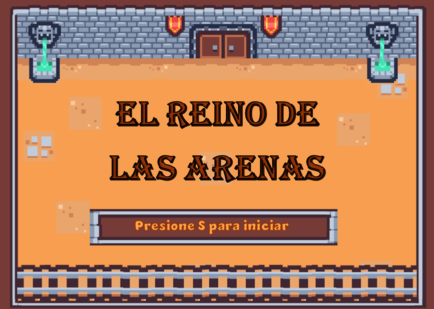
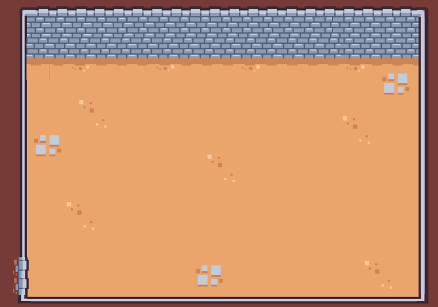
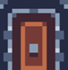

#  EL REINO DE LAS ARENAS

UTN - Facultad Regional Buenos Aires - Materia Paradigmas de Programación

## Equipo de desarrollo: 

- Juan Jose Nogueira
- Fabricio Lopez Garro
  
## Capturas 

![PersonajePrincipal] (assets/peque.png)
![Puerta] (assets/puerta1.png)
![Pinchos] (assets/pinchosDefinitivo.png)
![FondoDelJuego] (assets/nive.l.png)
![Bicho] (assets/enemigo.png)
![Reja] (asssets/reja2.png)

## Reglas de Juego / Instrucciones

Se necesitan llaves para pasar a las otras puertas
Las pociones suman vida
Cada enemigo y obstáculo resta vida

Si el nivel de vida llega a 0, se termina el juego

- Isaac es el personaje (OBJETO) principal de este juego, quien tiene que llegar hasta la salida del templo. Para ganar el juego hay que pasar por todas las habitaciones.
- Es necesario obtener las llaves para poder avanzar.
- Isaac no está solo, lo acompañan varias CLASES, que obstaculizaran el entorno de nuestro personaje.
- Por un lado los obstaculos fijos, que no tienen movimiento alguno. Los pinchos restan 5 puntos de vida al acercarse a ellos. Las rejas no hacen daño pero no se pueden atravesar.
- Por otro lado tambien hay enemigos que se mueven. Los bichos restan 10 de vida. Los magos atacan con un veneno que va restando vida en un tiempo determinado. Los fantasmas restan 15 de vida y aparte le sacan la armadura a Isaac
- Las pociones son importantes para no perder tanta vida.

## Controles:

- `Up` `Down` `Left` `Right` para moverse en el juego
- `S` para iniciar

## Teoria:

El juego inicia con una pantalla de carga que te muestra el título del juego. Lo primero que se inicia es el objeto nivel, que contiene las constantes del ancho y largo de la pantalla. También tiene una variable llamada escenarioActual, el cual indica el escenario en el que estamos. Al apretar el boton `S` se inicia el juego y se carga el primer nivel.

El personaje principal es isaac, es un objeto ya que no va a haber otro personaje como él. Las variables mas importantes son la de posicion, las de vida y la de tieneLlave. Isaac es el que entiende el método moverse(nuevaPosicion), esta nueva posición se envía desde el objeto nivel, y se activa cada vez que se presiona las letras `Up` `Down` `Left` `Right`. Asimismo Isaac, al ser el personaje que avanza en los escenarios, es el que entiende el mensaje avanzarNivel(). Cada vez que se colisiona con una puerta se envía desde el personaje el mensaje cambiarEscenario() a nivel, para que se cambie el escenario. Cada vez que él se acerca a un cofre, este le otorga a isaac una armadura y +20 de vida. También al acercarse a las pociones se le suma +20 de vida. Isaac tambien tiene otro método que es danio(cant), que reduce una cantidad de vida al personaje, si la vida llega a 0, entonces se envia a nivel el mensaje del game over. Este mensaje va a ser enviado desde los enemigos y obstaculos que dañen a isaac. Todos los elementos que interactuen con Isaac comparten el método interactuar().

Los enemigos están codificados como una clase, no solo porque va a haber varios de ellos sino que algunos van a heredar algunos métodos relacionados con el movimiento. Los enemigos pueden tener un movimiento vertical u horizontal en un espacio determinado. El enemigo mas común es el bicho, lo único que hace al chocarse con Isaac es restarle 10 puntos de daño. Otro enemigo es el mago, el cual le aplica un veneno al personaje y le va restando una unidad de vida en un tiempo de 600ms. Por último se encuentra el fantasma, el cual le infringe 15 de daño y despoja al héroe de sus armaduras. Si Isaac pierde sus armaduras puede aumentar su nivel de daño. El bicho le hace 15 de daño y el mago alarga su tiempo de efecto a 900ms.

Otros elementos importantes del juego son los obstáculos, objetos (clases) inmóviles que se encuentran en el escenario. Estos carecen de movimiento por lo que no van a entender el mensaje moverse() pero si el mensaje interactuar(). Cuando un pincho toca a isaac este le reduce 5 puntos de vida. Cuando una puerta interactua con isaac no le hace nada, su configuracion de colisión se encuentra en el objeto nivel. Las rejas lo bloquean si quiere avanzar hacia un sentido. 

Cada nivel es un escenario el cual está representado en una clase Escenario. En este juego disponemos de 3 niveles para completar. Esta contiene la posición de las llaves en cada nivel, el método para agregar a isaac al mapa y un metodo visuales() abstracto. Cada escenario que hereda estos comportamientos utiliza visuales para agregar sus propias imagenes, ya que cada uno es diferente al otro.